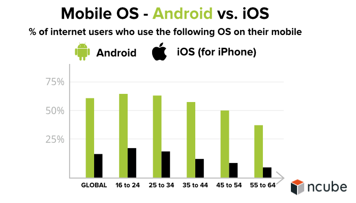
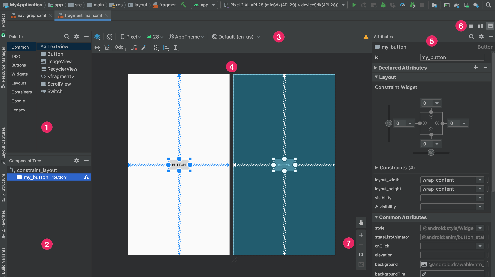
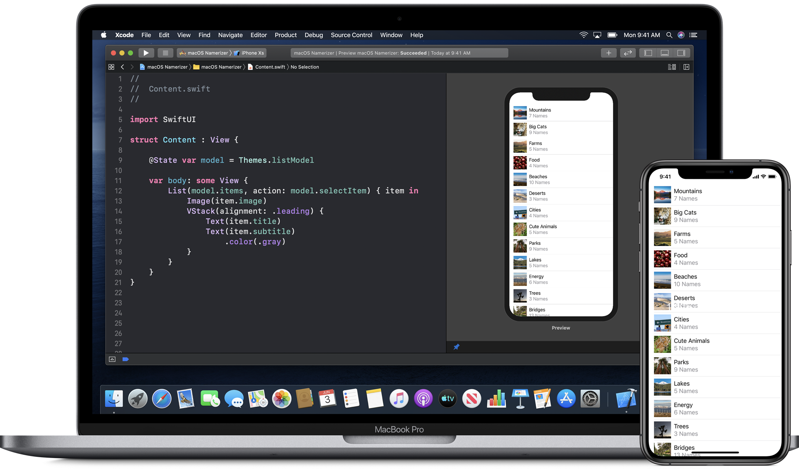
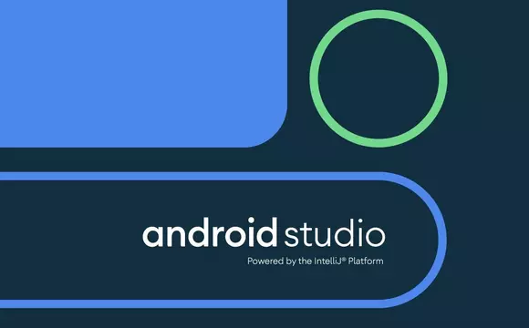
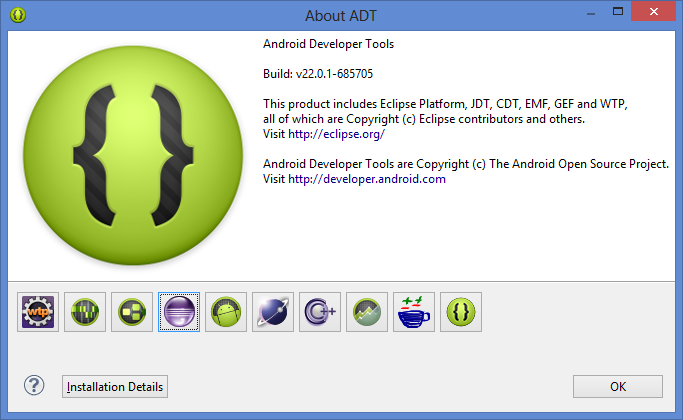

# iOS vs Android

*  🔖 **iOS et Android SDK**
*  🔖 **Interface Builder et l'environnement iOS**
*  🔖 **Eclipse ADT et Android Studio**

___

## 📑 iOS et Android SDK

> Android n'a pas la meme approche qu'Ios sur la distribution de son Software Development Kit

### 🏷️ **Android**

Le code source principal d'Android s'appelle Android Open Source Project (AOSP). La manière la plus courante pour les développeurs d'applications de développer sur Android consiste à utiliser l'IDE Android Studio avec Java et le SDK Android.

### 🏷️ **Ios**

Apple a conçu iOS pour fonctionner spécifiquement sur ses propres appareils Apple tels que l'iPhone et l'iPad. Même si Android domine le marché mondial, Apple a des revenus massifs car il est répandu dans les pays plus développés où les gens dépensent plus d'argent.

___

## 📑 Interface Builder et l'environnement iOS

Les deux environnements ont pris des options radicalement différentes.

### 🏷️ **Layout Editor**

Sur Android Studio, les développeurs suivent le guide line Google Material Design via le "Layout Editor". La syntaxe générée est du `XML`.

### 🏷️ **Swift UI**

Sur XCode, il y a plusieurs options d'implémentation des interfaces. Swift propose d'être cross plateform dans l'éco système Apple et adopte une `syntaxe déclarative` mais ce n'est pas du `markup`.

___

## 📑 Eclipse ADT et Android Studio

Sur Android il y a deux solutions de code majoritaire.

### 🏷️ **Android Studio**

Android Studio est un environnement de développement pour développer des applications mobiles Android. Il est basé sur IntelliJ IDEA et utilise le moteur de production Gradle. Il peut être téléchargé sous tous les systèmes d'exploitation.

> En 2014, Android Studio passe à sa version stable et devient alors conseillé par Google, et Eclipse est délaissé.

### 🏷️ **Eclipse ADT**

Eclipse embarquant les "Android Development Tools" permet de développer pour Android. La communauté préfère cette solution de développement bien que non recommandée pour sa rapidité et sa simplicité de traitement dans l'IDE phare de Java.

___

👨🏻‍💻 Manipulation

Nous aurons besoin de ces environnement. Je vous invite à installer le JDK et Android Studio. Quelle version de Java devons nous installer?