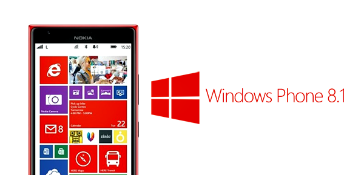
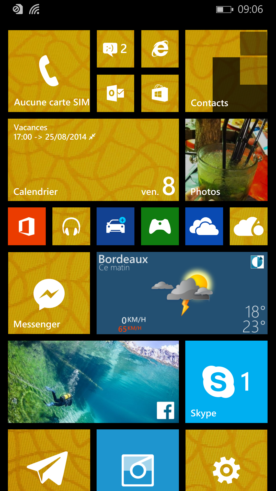
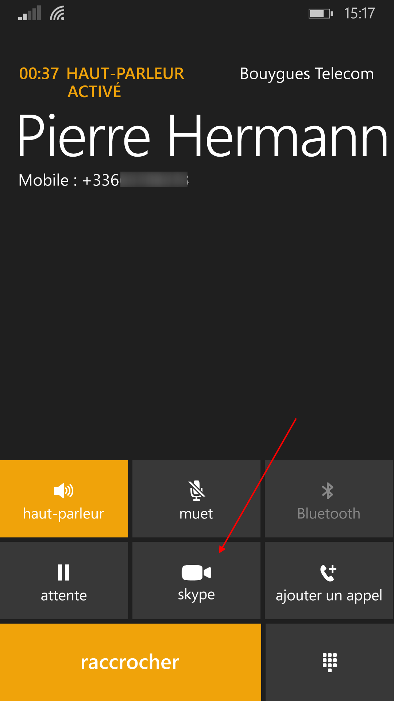
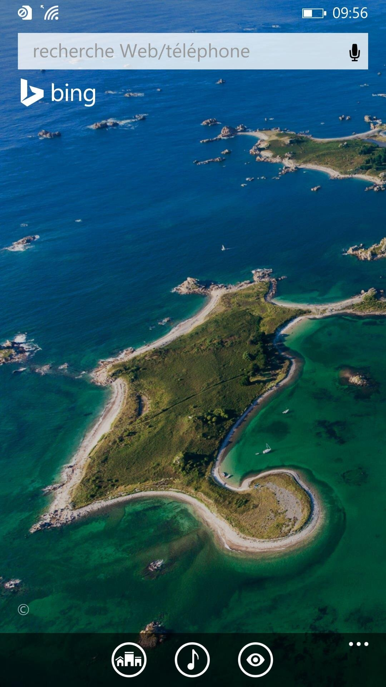

# Windows Phone

*  🔖 **Une offre complète**
*  🔖 **Apports de Windows Phone 8**
*  🔖 **Autres solutions**

___

## 📑 Une offre complète

Windows Phone fait l'objet d'une mise à jour à la fin de l'année 2015, dans le but d'unifier le système d'exploitation mobile avec celui pour tablette et celui pour PC.

La nouvelle plateforme, Windows 10, permet de disposer de la même base dans toutes ses versions et sur tous les appareils, qui évolue par mises à jour cumulatives. Windows Phone devient ainsi Windows 10 Mobile.

Microsoft abandonne son système d'exploitation Windows Phone 8 en 2017. La période de prise en charge du système par Microsoft est terminée et le système est donc définitivement abandonné. Windows 10 Mobile devrait donc bientôt connaître le même destin funeste que Windows Phone.

___

## 📑 Apports de Windows Phone 8

### 🏷️ **Ecran**

Un écran d'accueil condensé et plus personnalisable.

### 🏷️ **Skype**

L'intégration Skype permet de passer en appel vidéo.

### 🏷️ **Bing**

Bing permet de rechercher sur le web et dans le téléphone

### 🏷️ **Echec**

Ce smartphone se difévencient de la concurence de de façon qualitative mais quelque soit les apports, cela n'a pas pris.

> Les jeunes qui ont grandi en détestant Microsoft étaient ceux qui faisaient des starts-up pour pousser les autres plateformes.

Dès 2014, les gens étaient plutôt à l'aise avec iOS ou Android et même si Windows Phone avait des applications et d'autres choses dont les autres manquaient, ne sont pas devenus une raison suffisante de switcher

___

## 📑 Autres solutions

Il existe d'autres platformes qu'Android, Ios, Windows.

### 🏷️ **BlacBerry**

En 2016, les parts de marché du BlackBerry ont atteint 0,0% avec 207.900 terminaux vendus dans le monde (hors terminaux Android), selon Gartner14. L'entreprise annonce en septembre cesser la fabrication de téléphones.